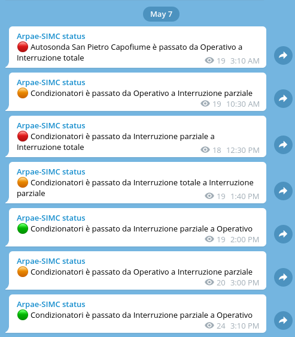
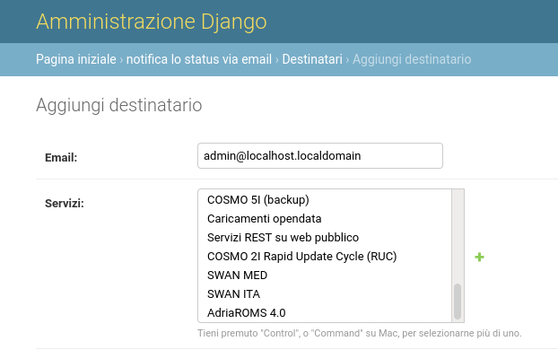

# statusboard-notify

[](https://github.com/edigiacomo/django-statusboard-notify/actions/workflows/build.yml)
[](https://pypi.python.org/pypi/django-statusboard-notify/)
[](https://codecov.io/gh/edigiacomo/django-statusboard-notify)

Utility for [django-statusboard][1] that notifies users about service status
changes. The notification are sent via email or published in a Telegram channel.

This app periodically notifies about service status changes - except for
changes from "Operational" to "Performance issues" (and viceversa).



## Installation

Install the package:

```sh
pip install django-statusboard-notify[with_telegram]
```

If you don't need Telegram notifications, you can install the package without
the `with_telegram` extra.

## Configure the application

Add the following applications to your Django projects:

```python
# settings.py
INSTALLED_APPS += [
    'statusboard',
    'statusboard-notify',
]
```

### Email notification

In order to enable the email notifications, you have to set the sender:

```python
# settings.py
STATUSBOARD_NOTIFY_EMAIL_SENDER = "statusboard@localhost.localdomain
```

You can edit the subject:

```python
# settings.py
STATUSBOARD_NOTIFY_EMAIL_SUBJECT = "Mysubject"
```

You can add a list of recipients that will receive the notifications about all
the services:

```python
# settings.py
STATUSBOARD_NOTIFY_EMAIL_RECIPIENTS = [
    "admin@localhost.localdomain",
    "anotheradmin@localhost.localdomain",
]
```

From the admin page you can associate an existing user to one or more services:



### Telegram notification

In order to enable the Telegram notifications, you have to:

1. Create a bot with [BotFather](https://telegram.me/botfather).
2. Create a channel.
3. Make your bot an admin of your channel.
4. Go to https://web.telegram.org and open the channel: the URL is something
   like `https://web.telegram.org/#/im?p=c1234567890_1231231231231231231`.
   The channel id is the concatenation of `-100` and the numbers between `c`
   and `_` (in the example, `1234567890`, then the chat id is `-1001234567890`).

The, add the following variables to your `settings.py`.

```python
# settings.py
STATUSBOARD_NOTIFY_TELEGRAM_TOKEN = "TELEGRAM-TOKEN-FROM-BOTFATHER"
STATUSBOARD_NOTIFY_TELEGRAM_CHAT_ID = -1001234567890
```

### Configure the notification script

The notifications are fired by command `send_notifications`, that reads the
notification queue from the DB and sends the services status changes to the
recipients (the notifications are then removed).

You can activate the command using `crontab`, `systemd`, `celery`, etc. Below,
an example with `crontab`:

```
# Check every 10 minutes for service status changes
*/10 * * * * /path/to/django/project/manage.py send_notifications
```

## Contact and copyright information

Copyright (C) 2021 Emanuele Di Giacomo <emanuele@digiacomo.cc>

django-statusboard-notify is licensed under GPLv2+.

[1]: https://github.com/edigiacomo/django-statusboard
